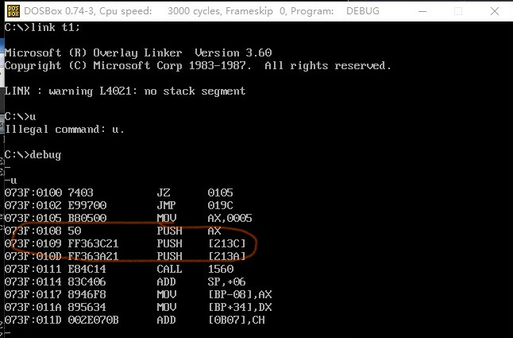

[toc]
#地址线，数据线，控制线
##地址线
    决定了cpu的寻址能力 
    有几条地址线就能找到最大为
   $2^n$的地址
##数据线
    决定cpu的和其他部件进行数据传送时一次性能传送多少字节的能力
 在内存中最小的数据为1字节 ```1byte=8bit```  ```8```    个二进制位
    ```FC为1110 1011```


##控制线
    决定cpu对其他部件进行控制的能力

##测试
###寻址能力的计算
    1个cpu的寻址能力为8kb，那么他的地址总线宽度为？
```math
解：8kb=2^3*2^{10}=2^{13}\\
```
    数据线总宽度为16根，20，24，32，求寻址能力
```math
解：16->2^6*2^{10}为64KB

```
###数据总线
```
宽度分别为8，8，16，16，32，则可依次传送的数据为_B _B_B_B_B_B
```
```math
1byte=8bit\\
解：11 2 2 4
\\
1024
```
#内存
内存，显存
对显存修改就会显示到显示屏幕上
<font size=5>1:cpu和计算机各个部件的关系？
<font color=blue>答:给他们编号，控制他们
2:RAM允许读取和写入 断电后指令和数据就丢失了
3:ROM只允许读取     断电会数据还村子啊   一般用在启动计算器上面
</font>
</font>
##cpu是通过内存地址来访问鼠标键盘的吗？
<big>答：</big>鼠标键盘<big>也</big>上都有一块芯片来储存指令和数据，cpu是通过三根线读出外设发送到端口的数据
```
端口：
列如60H为端口号
in——>input
out——>output
读取与写入
控制线 读取信息

```
cpu通过端口号来控制鼠标键盘


<big>gpu分工进行图形处理</big>


#寄存器
cpu通过三条线来访问内存空间，端口，那么cpu中一定有地方来存放这些地址和数据信息的地方，这个地方就叫$寄存器$

$我们程序员就是通过汇编语言中的汇编指令去修改寄存器中的内容从而控制cpu就可以控制整个计算机$

##数据寄存器，特殊位寄存器
除了AX BX CX DX外其他都是16为寄存器
他们特殊的原因是他们可以$分割为两个八位寄存器$
AX =AH+AL H为高的意思 AH为高八位AL为低八位

```
1.目的，为了兼容之前的cpu（8086）
2.1字节为8比特，8byte的数据储存到8为寄存器中
8086有16根数据线可以储存两种尺寸的数据
字节型byte 8bit-8位寄存器中
字形数据 2byte=16bit=16位寄存器中 2个字节,有高位字节和低位字节/（AH。。。）（AL。。。）
```
##小测试
mov指令中要保持位数一致性。八位数据不能移动到会出现error

add指令，同位正常相加
不同位时
```
mov ax,93//把ax中的值变为93
//显示：ax=0093
add al,85//把al中的值加85再给al
//显示：ax=18
解释：16位93+85=11超过了8位寄存器的最大值，所以显示位18
```
$寄存器运行时是互相独立的不影响其他寄存器$
##地址寄存器
段地址寄存器   ,偏移地址寄存器
ds  ---------------            sp
es              ----------------bp      
ss  ----------------            si
cs              -----------------di
                ---------------------ip

--------------------bx
$产生段地址和偏移地址的原因$
因为8086是16为寄存器而有20根地址线，限制了cpu的表达能力
$解决方法$
地址加法器
```math
    段地址*10H+偏移地址=物理地址\\
 段地址*16===========基础地址
```
偏移地址的变化范围位（0~FFFFH）
##cpu如何区分指令和数据
u指令   将某个内存地址全当成指令
d指令   将某个内存地址全当成数据
```
mov ax,0//指令
-->ax=0000；同时间ip
由0100变为0103
```
$8086cpu中，在任意时刻，cpu将cs，ip所指向的内容全部当作数据$

##指令的执行过程
<h2 id="指令执行的过程">指令的执行过程</h2>
1.cpu从cs：ip所事项的内存单元读取指令，存放带指令缓存区中

2.ip=ip+所读指令的长度，从而只想下一条指令
3。执行指令缓存中的内容，回到步骤1


如图所示 mov bx,1000为三个字节，所以从B8 00 10移动三位到BB 00 10
而MOV bl,10 所用的是两个字节，所以ip的值+2，地址值向后移动了两位

##指令是有长度的

一条指令可以由多个字节构成

##汇编指令 jmp or jump
$转移指令，可以修改s和ip这两个寄存器  决定了cpu从哪里读取指令
```
jmp 2000:0
jmp 寄存器
```
$题目$
1.假设cs=2000H，ip=0000，写出下列指令的执行过程
```
a 2000:0
mov ax,6622H
jmp 1000:3
mov cx,ax

a 1000:0
mov ax,0123H
mov ax,0
mov bx,ax
jmp bx   \\这条指令为2字节，ip应该从8指向10（指向mov cx,0），再执行指令缓存器中的内容(jmp bx),直接跳到               \\0000，因此不执行mov cx,0
mov cx,0
```
答案：
[指令执行的过程](#指令执行的过程)